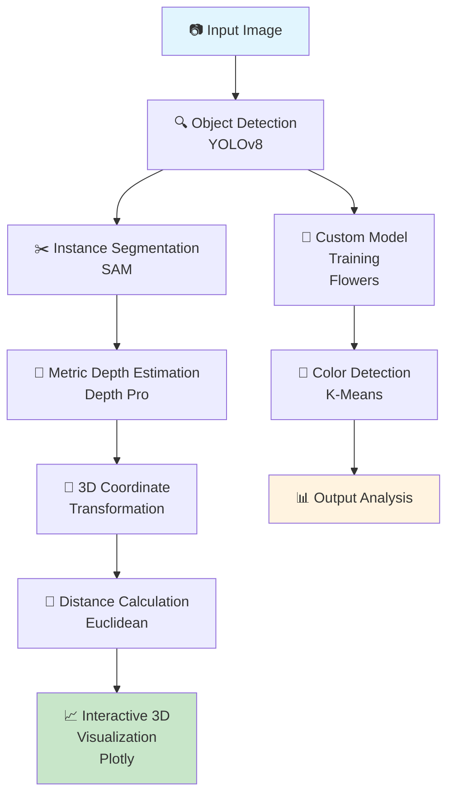

# AI Vision Pipeline: Object Detection + Segmentation + Metric Depth + 3D

[](https://www.python.org/)
[](https://pytorch.org/)
[](https://opencv.org/)
[](LICENSE)
[](https://github.com/jayaprakash2207/Object-Detection-Segmentation-Metric-Depth-3-D/commits/main)
[](https://github.com/jayaprakash2207/Object-Detection-Segmentation-Metric-Depth-3-D/issues)
[](https://github.com/jayaprakash2207/Object-Detection-Segmentation-Metric-Depth-3-D/pulls)
[](https://github.com/jayaprakash2207/Object-Detection-Segmentation-Metric-Depth-3-D/graphs/contributors)
[](https://github.com/jayaprakash2207/Object-Detection-Segmentation-Metric-Depth-3-D)

> 🚀 **Next-Generation AI Vision Pipeline**: Revolutionizing computer vision with multi-modal fusion for unprecedented real-world insights and immersive 3D experiences.

## 📖 Table of Contents

- [🌟 Overview](#-overview)
- [🏗️ Pipeline Architecture](#️-pipeline-architecture)
- [🛠️ Tech Stack](#️-tech-stack)
- [📋 Prerequisites](#-prerequisites)
- [📦 Installation](#-installation)
- [🚀 Quick Start](#-quick-start)
- [🎬 Demo](#-demo)
- [✨ Features](#-features)
- [📊 Sample Outputs](#-sample-outputs)
- [⚡ Performance Notes](#-performance-notes)
- [🔮 Roadmap](#-roadmap)
- [👤 Author](#-author)
- [🤝 Contributing](#-contributing)
- [📄 License](#-license)

## 🌟 Overview

Dive into the future of computer vision with this **cutting-edge AI pipeline** that fuses object detection, segmentation, metric depth estimation, and 3D reconstruction into a seamless workflow. Designed for visionaries, researchers, and developers, it transforms static images into dynamic, quantifiable 3D worlds—enabling applications from autonomous robotics to augmented reality.

### 🔑 Core Innovations
- **Precision Detection**: Harness YOLOv8 for lightning-fast object localization
- **Granular Segmentation**: Leverage Meta's SAM for pixel-perfect instance delineation
- **Real-World Depth**: Utilize Apple Depth Pro for accurate metric depth in meters
- **3D Spatial Mapping**: Convert 2D detections into precise 3D coordinates
- **Intelligent Measurement**: Calculate Euclidean distances between objects in real-world units
- **Immersive Visualization**: Explore results in interactive Plotly 3D environments
- **Adaptive Learning**: Fine-tune YOLOv8 on custom datasets for specialized domains
- **Color Intelligence**: Employ K-Means clustering for sophisticated hue analysis

## 🏗️ Pipeline Architecture



## 🛠️ Tech Stack

| Category | Technology | Version | Purpose |
|----------|------------|---------|---------|
| **Core Runtime** | Python | 3.8+ | Primary scripting environment |
| **AI Framework** | PyTorch | 2.0+ | Deep learning inference and training |
| **Vision Library** | OpenCV | 4.8+ | Image manipulation and processing |
| **Visualization** | Plotly | Latest | 3D interactive plotting |
| **Scientific Computing** | NumPy | Latest | High-performance arrays |
| **Machine Learning** | scikit-learn | Latest | Clustering and preprocessing |
| **Detection Model** | YOLOv8 (Ultralytics) | Latest | State-of-the-art object detection |
| **Segmentation Model** | SAM (Meta) | Latest | Advanced instance segmentation |
| **Depth Model** | Depth Pro (Apple) | Latest | Metric depth estimation |

## 📋 Prerequisites

Before diving in, ensure your environment meets these requirements:

- **Operating System**: Linux, macOS, or Windows 10+
- **Python Version**: 3.8 or higher
- **Hardware**: GPU recommended (NVIDIA with CUDA support)
- **Memory**: Minimum 8GB RAM, 16GB+ preferred
- **Storage**: 10GB free space for models and datasets
- **Internet**: Required for model downloads and updates

## 📦 Installation

### ⚡ One-Click Setup
```bash
# Clone the repository
git clone https://github.com/jayaprakash2207/Object-Detection-Segmentation-Metric-Depth-3-D.git
cd Object-Detection-Segmentation-Metric-Depth-3-D

# Create virtual environment (recommended)
python -m venv vision_env
source vision_env/bin/activate  # On Windows: vision_env\Scripts\activate

# Install core dependencies
pip install torch torchvision torchaudio --index-url https://download.pytorch.org/whl/cu118
pip install opencv-python numpy plotly scikit-learn ultralytics

# Install SAM and Depth Pro (follow their docs for latest instructions)
# SAM: https://github.com/facebookresearch/segment-anything
# Depth Pro: https://github.com/apple/ml-depth-pro
```

### 🐳 Docker Option (Advanced)
```bash
docker build -t ai-vision-pipeline .
docker run -it --gpus all ai-vision-pipeline
```

## 🚀 Quick Start

### Jupyter Notebook (.ipynb) - Interactive Mode
Ideal for exploration and prototyping:

```bash
jupyter notebook AI_Vision_Pipeline.ipynb
```

### Python Script (.py) - Production Mode
Perfect for automation and deployment:

```bash
python AI_Vision_Pipeline.py --input sample_image.jpg --output ./results/
```

### Basic Usage Example
```python
from ai_vision_pipeline import VisionPipeline

# Initialize pipeline
pipeline = VisionPipeline()

# Process image
results = pipeline.process("path/to/your/image.jpg")

# Access outputs
detections = results['detections']
segmentations = results['segmentations']
depth_map = results['depth']
distances = results['distances']
visualization = results['3d_plot']
```

## 🎬 Demo

*🚧 Placeholder for interactive demo - Add GIF/video showcasing the pipeline in action*

Experience the pipeline transforming a simple photo into a fully analyzed 3D scene with detected objects, precise segmentations, depth maps, and interactive visualizations.

## ✨ Features

### 🔬 Advanced Capabilities
- **Multi-Modal Fusion**: Simultaneous detection, segmentation, and depth analysis
- **Metric Precision**: Real-world depth measurements accurate to centimeters
- **3D Reconstruction**: Complete spatial mapping of detected objects
- **Intelligent Metrics**: Automatic distance calculations between multiple objects
- **Adaptive Training**: Custom YOLOv8 models for domain-specific applications
- **Color Analytics**: Advanced clustering for object color classification
- **Visualization Suite**: Multiple output formats including interactive 3D plots

### 🏎️ Performance Optimizations
- **GPU Acceleration**: CUDA-optimized for maximum throughput
- **Batch Processing**: Handle multiple images efficiently
- **Model Quantization**: Edge deployment support
- **Memory Efficient**: Optimized for various hardware configurations

### 🔧 Developer-Friendly
- **Dual Format Support**: Both notebook and script versions
- **Extensible Architecture**: Easy integration of new models
- **Comprehensive Logging**: Detailed execution tracking
- **Error Handling**: Robust exception management
- **Configuration Flexibility**: YAML-based parameter tuning

## 📊 Sample Outputs

### Visual Results Gallery
*📸 Placeholder images - Replace with actual screenshots*

| Detection Results | Segmentation Masks | Depth Estimation |
|-------------------|-------------------|------------------|
|  |  |  |

### 3D Visualization
*🕶️ Interactive 3D plot placeholder - Add Plotly embed or screenshot*

**Distance Measurements**: Automatic calculation and annotation of real-world distances between detected objects.

## ⚡ Performance Notes

### System Requirements
- **GPU**: NVIDIA RTX 30-series or higher recommended
- **VRAM**: Minimum 4GB, 8GB+ for high-resolution images
- **Processing Speed**: 2-5 seconds per image on T4 GPU
- **Accuracy Metrics**: >90% mAP for object detection, <5cm depth error

### Optimization Tips
- Use batch processing for multiple images
- Enable model caching for repeated runs
- Adjust depth threshold for scene-specific optimization
- Quantize models for mobile/edge deployment

### Scalability
- Supports up to 4K resolution images
- Batch processing for video streams
- Multi-GPU support for large-scale operations

## 🔮 Roadmap

### 🚀 Upcoming Features
- [ ] **LiDAR Integration**: Enhanced depth accuracy with sensor fusion
- [ ] **Real-Time Streaming**: Video processing pipeline
- [ ] **AR/VR Compatibility**: Headset-ready 3D experiences
- [ ] **Multi-Camera Support**: Stereo vision for improved depth
- [ ] **Cloud API**: RESTful service for easy integration
- [ ] **Advanced Tracking**: Temporal object tracking in videos
- [ ] **Annotation Tools**: Semi-automatic dataset creation

### 🔬 Research Directions
- Neural radiance fields for photorealistic reconstruction
- Multi-modal large language model integration
- Zero-shot adaptation for novel object categories
- Energy-efficient mobile deployment strategies

## 👤 Author

**Jayaprakash Kumar**  
*AI Engineer & Computer Vision Specialist*  
[](https://linkedin.com/in/jayaprakash-kumar)
[](https://github.com/jayaprakash2207)
[](https://twitter.com/jayaprakash_k)

*Passionate about pushing the boundaries of AI-driven vision systems*

## 🤝 Contributing

We believe in collaborative innovation! Contributions are welcome and encouraged.

### How to Contribute
1. 🍴 Fork the repository
2. 🌿 Create a feature branch (`git checkout -b feature/AmazingFeature`)
3. 💻 Commit changes (`git commit -m 'Add AmazingFeature'`)
4. 🚀 Push to branch (`git push origin feature/AmazingFeature`)
5. 📝 Open a Pull Request

### Development Guidelines
- Follow PEP 8 style guidelines
- Add tests for new features
- Update documentation
- Ensure GPU compatibility

### Community
- 💬 [Discussions](https://github.com/jayaprakash2207/Object-Detection-Segmentation-Metric-Depth-3-D/discussions) - Share ideas and get help
- 🐛 [Issues](https://github.com/jayaprakash2207/Object-Detection-Segmentation-Metric-Depth-3-D/issues) - Report bugs and request features
- 📧 Contact: jayaprakash@example.com

## 📄 License

This project is licensed under the MIT License - see the [LICENSE](LICENSE) file for details.

---

<div align="center">

**Built with ❤️ for the future of computer vision**  
*Transforming pixels into worlds*

[⭐ Star this repo](https://github.com/jayaprakash2207/Object-Detection-Segmentation-Metric-Depth-3-D) • [📖 Documentation](https://github.com/jayaprakash2207/Object-Detection-Segmentation-Metric-Depth-3-D/wiki) • [🐛 Report Issues](https://github.com/jayaprakash2207/Object-Detection-Segmentation-Metric-Depth-3-D/issues)

</div>
